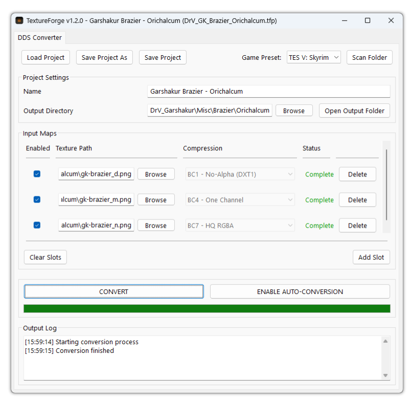

<h1>🔥TextureForge🔥</h1>
     

    TextureForge is an open-source suite of texture tools that aims to streamline the texture workflow for 
    Game Developers and 3D Asset Creators. The goal of this project is to provide a collection of useful utilities 
    that automate, optimise and - where possible - eliminate tedious and repetitive texturing tasks.

      

<h2>:gem: Features</h2>
 
<ul>
    <li>
        <strong>🔁DDS Image Conversion </strong>
         Easily convert PNG, JPG, BMP and other common image formats into DDS files with a variety of compression options
    </li>
     
    <li>
        <strong>📒 Project-based workflow</strong>
         Easily switch between assets by saving and loading your configuration to TextureForge project files
    </li>
     
    <li>
        <strong>🔧 Automatic and Manual Conversion Options</strong>
         Convert your files manually with a single click, or turn on automatic conversion to have TextureForge detect changes to your texture files and
        convert them automatically
    </li>
</ul>
     

<h2> ⚡ Application </h2>
 

    

 
    
<h2>📌 Acknowledgedments and External Resources</h2>
<ul>
    <li>
        Built using <a href="https://github.com/wxWidgets/Phoenix">wxPython</a>
    </li>
    <li>
        DDS functionality powered by <a href="https://github.com/microsoft/DirectXTex/wiki/Texconv">DirectXTex</a>
    </li>
</ul>

<h2> 👐 Contributions</h2>
Contributions are welcome for this project. Whether it's a bug fix, feature, or even a suggestion, feel free to open an Issue or submit a Pull Request
